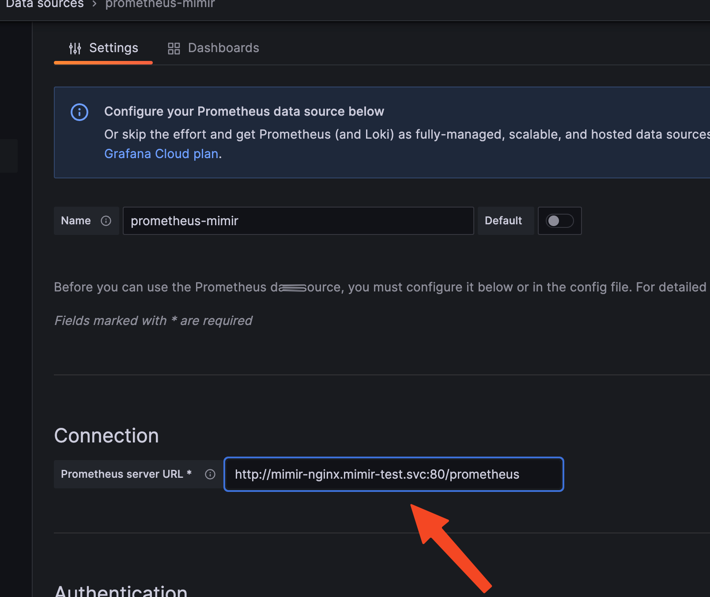
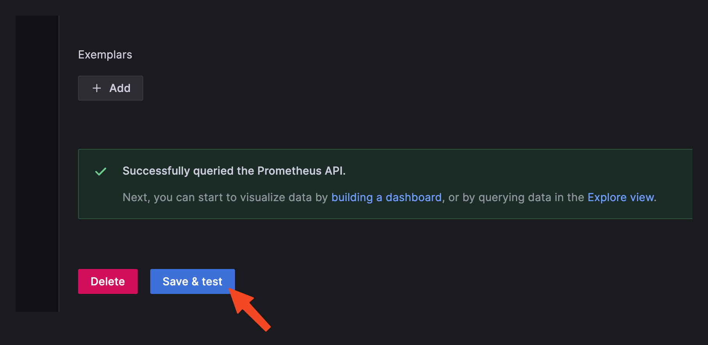

# Kubernetes Cluster Monitoring using Grafana, mimir and Grafana agent


## Installation

Installing grafana agent : 
```
helm repo add grafana https://grafana.github.io/helm-charts
helm repo update
helm install agent grafana/grafana-agent --set agent.mode=static
```
Installing grafana : 
```
helm repo add grafana https://grafana.github.io/helm-charts
helm repo update
helm install grafana grafana/grafana
kubectl get secret --namespace default grafana -o jsonpath="{.data.admin-password}" | base64 --decode ; echo
kubectl expose service grafana --type=NodePort --target-port=3000 --name=grafana-ext
kubectl port-forward svc/grafana-ext 32509:80
```

Installing mimir : 
```
kubectl create namespace mimir-test
helm repo add grafana https://grafana.github.io/helm-charts
helm repo update
helm -n mimir-test install mimir grafana/mimir-distributed
kubectl -n mimir-test get pods
kubectl port-forward -n mimir-test svc/mimir-distributor 8080:8080
```
## Now i need to Configure Grafana Agent to write to Grafana Mimir

## Before that lets recreate a connection and check that are we getting any data:

Follow the given steps : 






## Contributing

Pull requests are welcome to discuss what you would like to change.
